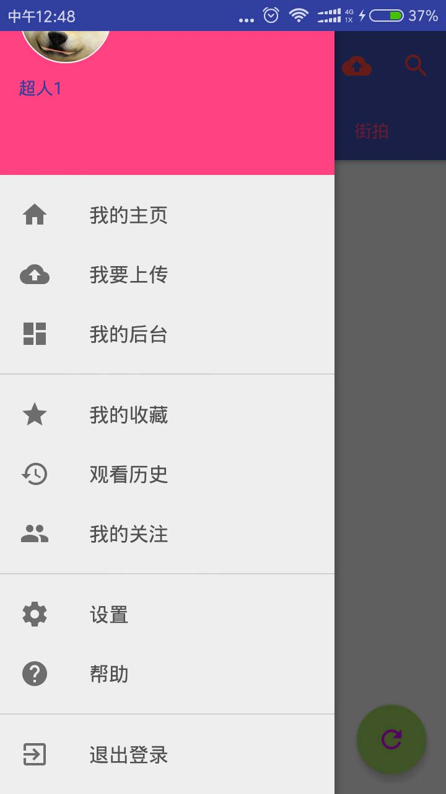

# 韦驮天视频APP客户端
---

基于Retrofit + Okhttp + RxJava + Material Design + GreenDao + OkHttpUtil + mosby MVP  
UI设计等仿照[bilibili-android-client](https://github.com/HotBitmapGG/bilibili-android-client)

## 配合JavaWeb后端

[韦驮天视频分享-Web后端](https://git.oschina.net/weituotian/weituotian-video)

## 截图

## Thanks to the open source project 使用框架

* [AndroidFire](https://github.com/jaydenxiao2016/AndroidFire)
* [bilibili-android-client](https://github.com/HotBitmapGG/bilibili-android-client)

* [RxJava](https://github.com/ReactiveX/RxJava)
* [RxAndroid](https://github.com/ReactiveX/RxAndroid)
* [RxLifecycle](https://github.com/trello/RxLifecycle)
* [RxCache](https://github.com/VictorAlbertos/RxCache)
* [okhttp](https://github.com/square/okhttp)
* [okhttputils](https://github.com/hongyangAndroid/okhttputils)
* [retrofit](https://github.com/square/retrofit)
* [butterknife](https://github.com/JakeWharton/butterknife)
* [glide](https://github.com/bumptech/glide)
* [FlowLayout](https://github.com/hongyangAndroid/FlowLayout)
* [greenDAO](https://github.com/greenrobot/greenDAO)
* [EventBus](https://github.com/greenrobot/EventBus)
* [mosby](https://github.com/sockeqwe/mosby)

## feature

* 持久化登录，配合Java Web后端的shiro的Cookies Auth, WebView实现自动登录
* 基于okhttputil带进度条上传视频
* 自定义视频view进行视频截图
* 自定义验证TextInputLayout验证框架，使用builder模式

## 文档

### moudle依赖

1)	**app** 模块，视频应用主模块
2)	**jcvideoplayer-lib** 引用的播放视频的开源第三方库
3)	**mediapicker** 提供选择图片，选择视频的第三方库
4)	**videoScreenShot** 实现视频截图，主模块上传视频的时候会用到

### 主模块下的分包结果

1)	**activity** 存放应用内所有的activity
2)	**adapter** 常用的和公用的adapter，view和数据交互用
3)	**entity** 实体类，服务器返回的json数据将解析为这里的java bean对象
4)	**event** 一些view控件的自定义事件
5)	**factory** Refrofit实例化接口用
6)	**fragment** 存放应用内所有的Fragment
7)	**http** 存放定义服务器请求的类
8)	**mvpview** 所有mvpview的接口
9)	**presenter** presenter统一管理
10)	**utils**  一些工具类
11)	**widget** 一些自定义的view
12)	**GlobalConstant** 存放全局变量
13)	**VideoApp** 继承Android Appilication的类

##

## 视频分享APP的功能性需求分析

通过对收集到用户对该系统的功能基本需求进行整理综合，本系统可以有两种用户类型：普通会员和管理员。普通会员具有观看视频，上传视频，空间展示，个人资料，发布评论，收藏视频，历史记录等模块。管理员主要功能是权限管理，视频审核。

#### 用例

#### 视频列表模块

视频列表模块具有显示最新视频的功能，用户可以选择下拉刷新或者下拉加载更多。同时通过分标签页页显示不同分区的最新视频。视频列表中显示视频的截图，标题，上传者的名称，播放量，发布时间等，用户对感兴趣的视频可以点击进去查看。

#### 视频详情模块

用户从列表中点击某一个视频便进入这个模块，该模块加载视频的详细信息，包括用户头像，名称，视频标题，描述，播放量，封面等。提供视频的播放功能，可以缓冲加载视频，打开全屏等。最后也提供一些关注和收藏的按钮。

#### 登录模块

用户在视频App首页点击顶部工具条可以打开登录界面。该界面提供用户名输入和密码输入，提交后会将信息提交到后端服务器验证，验证成功后返回成功信息，同时持久化用户的登录状态，使用户可以在下一次打开App的时候不用重新加载

#### 登录模块流程

#### 关注模块

用户可以在上传者的视频播放界面或者上传者的空间展示首页，查看到上传者，这时可以点击关注按钮对上传者进行关注。关注行为将发送关注请求发送到web后端，后端更新关注者的关注数量和被关注者的粉丝数。成功关注会有成功提示。下一次进入被关注者的空间主页或者被关注者的视频播放页面，均可以对被关注者发送取消关注请求。

#### 关注模块流程

#### 视频收藏，分享模块

视频收藏模块，用户可以收藏自己喜欢的视频，收藏时会发送收藏请求到后端服务器，保存收藏数据在后端的数据库中。用户同时可以分享自己喜欢的视频，会自动调用系统的分享应用，从而可以分享到不同的社交应用中，如QQ和微信，同时自动填入视频标题，方便用户填写分享信息。

#### 视频评论模块

视频评论模块中，用户可以查看某一个视频的所有评论，下拉刷新评论，上拉加载更多评论。一条评论包括用户头像，用户名，评论内容，发布时间等信息。用户可以发布评论。评论时将发送评论到后台系统，后台系统处理完毕并且返回成功后，app客户端将会刷新当前评论列表，用户此时可以看到自己发出的最新评论

#### 个人空间模块

用户可以在APP首页的侧边栏点击我的控件或者我的头像进入个人空间首页，这个页面展示了用户的头像，用户名，性别，签名等。同时可以查看到用户的所有的发布视频，最新的视频将显示到最前面。用户的视频也是以下拉刷新，上拉加载更多的方式进行。

#### 我的后台模块

后台模块提供一个手机端的方式访问管理后台的web页面。这个模块可以由用户登录后使用。用户进入后可以访问到自适应的后台web页面，使用后台系统的所有功能，包括修改查看和修改个人信息，查看视频审核状态等。

#### 视频上传模块

视频上传模块提供用户上传视频的接口。用户进入上传视频的页面后，可以选择要上传的视频，选择的视频可以是手机中已经存在了的或者立即拍摄的。选择后，会提供用户简单的预览功能，确认视频的信息。同时在确认的过程中，用户可以点击截图功能，选择视频中合适的一帧作为视频的封面。上传视频的过程中，会有视频上传进度提示，用户可以取消一次尚未完成的视频上传。截图上传也会有上传进度提示。上传完视频之后，用户需要填写视频标题，描述，选择视频分区等信息。提交后会发送信息到后台服务器进行处理，后台返回成功信息后，用户只需耐心等待管理员审核视频成功。

#### 菜单模块

用户在登录之后，首页将会开发侧边栏的权限，菜单模块提供一个侧边栏，供用户选择不同的功能菜单，点击菜单将会跳转到不同的功能模块。

#### 视频分享APP的非功能性需求分析

整体要求。在系统风格方面，应该做到程序结构简明，结构条理清晰，功能实用；而在系统界面方面，应该在UI设计中做到布局简单合理，使用简单明了，系统整体风格统一。

账户安全与实用性相结合。实现APP持久化登录状态需要保存登录用户的信息，保存用户信息需要对用户信息进行加密，防止用户信息泄漏。

通信网络。根据系统要求，能在公共互联网上通信，访问系统服务器，实现数据的传送和接收。

适当的提示。视频上传过程中可能会遇到上传时间较长，导致用户等待时间长的情况出现，这时需要适当的提示，提示用户上传的进度等。视频播放的过程中可能加载时间较长，这时同样需要提示功能，提供用户加载视频需要一定时间。

#### 视频分享APP的数据获取接口

视频分享APP是一款与网络通信息息相关的应用。在使用的过程中，无可避免地需要使用到网络。为了方便APP接受后台服务器的数据，需要后台提供一系列的接口供APP获取数据

1. 视频信息，用户信息等普通信息接口：供登录用户和非登录用户同时使用，非登录用户同时可以访问系统，查看和播放视频
2. 后台操作等登录接口，除了提供登录的接口之后，还需要提供一系列的后台操作接口供APP使用，比如收藏，关注，发送评论，视频上传等都需要后台接口的使用，这些接口必须要验证用户身份，确保正确性。

##　测试

| **编号** | **标题** | **测试目标** | **操作过程** | **期望输出值** | **测试结果** |
| --- | --- | --- | --- | --- | --- |
| 1 | 登录模块测试 | 测试登录功能 | 使用数据库中已有的用户账号weituotian，密码1q2w3e4r,进行测试：输入用户名和密码，点击登录按钮 | 有toast提示成功信息。并且自动返回MainActivity界面 | 与期望值一致 |
|||| 用数据库中不存在的帐号weituotian2进行测试。  | Toast提示服务器返回的验证信息，帐号不存在 | 同上 |
|||| 使用已存在的帐号Weituotian进行测试输入错误的密码 | Toast提示服务器返回的验证信息，密码错误 |   |
| 2 | 注册模块测试 | 测试注册功能 | 填写小于6个字符的注册用户名 | Edittext提示输入不合法 | 同上 |
|||| 输入错误的邮箱 | Edittext提示邮箱错误  | 同上 |
|||| 输入不一样的重复密码 | 提示密码不一致 | 同上 |
|||| 输入除了以上的全部正确信息 | Toast提示服务器返回的信息，注册成功 | 同上 |
| 3 | 视频列表功能测试 | 测试能否正确加载视频列表，测试下拉刷新，上拉加载更多 | 进入首页的视频列表Fragment | 显示视频列表，陈功加载封面，标题等信息 | 同上 |
|||| 上拉视频列表加载更多 | 没有更多的时候底部显示没有更多视频信息，否则列表加载更多视频 | 同上 |
|||| 下拉视频列表刷新列表 | 列表被刷新并回到最上面 | 同上 |
| 4 | 视频详细页面加载 | 测试是否能成功加载视频的详细页面 | 在列表点击某个视频进入视频详情列表 | 加载某视频 | 同上 |
| 5 | 视频评论功能 | 测试视频的评论列表加载和能否发布评论 | 在视频详情列表滑动到评论tab，等待加载评论列表 | 评论列表成功加载 | 同上 |
|||| 上拉刷新评论 | 上拉的时候评论列表被刷新 | 同上 |
|||| 下拉加载更多评论 | 下拉加载了更多评论，没有更多的时候不会在重新加载 | 同上 |
|||| 输入评论内容，发布评论 | 发布评论之后，提示发布成功，列表随后被刷新 | 同上 |
| 6 | 视频播放功能 | 测试能否正确播放服务器的视频 | 进入视频详情页面，点击播放按钮，暂停按钮，拉动进度条 | 正确播放视频，暂停视频，拉动进度条的时候会跳到相应的时间段 | 同上 |
|||| 以上步骤后点击全屏按钮，播放一会儿后点击back键 | 进入全屏界面，点击back键后退出全屏，视频没有被中断 | 同上 |
| 7 | 关注功能 | 测试关注功能 | 在视频详情界面点击关注按钮 | 提示关注成功，然后按钮文本变为取消关注 |   |
|||| 上一步骤操作后，退出界面，重新进入 | 进入时的默认按钮是取消关注，表明上次已经进行过关注操作了 | 同上 |
| 8 | 收藏功能 | 测试视频的收藏功能 | 在视频详情界面点击收藏按钮 | 提示收藏成功，并且按钮文本变为取消收藏，按钮上面的收藏树+1 | 同上 |
|||| 上一步骤操作后，退出界面，重新进入 | 进入时的默认按钮是取消收藏，表明上次已经进行过收藏操作了 | 同上 |
| 9 | 上传视频 | 测试能否正确上传视频，上传封面，提交视频 | 视频上传界面，点击选择视频按钮，选择视频后返回 | 打开选择视频界面，选择视频后返回，可以预览要上传的视频 | 同上 |
|||| 接上一步骤操作后，预览视频，拖动进度条，点击截图按钮 | 在正确的视频位置截了图，显示到imageview上 | 同上 |
|||| 接上一步骤操作后，点击上传视频，上传封面按钮 | 上传过程中弹出对话框，显示上传进度，而且上传结束后对话框自动消失，提示上传成功 | 同上 |
|||| 选择分区，填写视频相关信息后提交视频 | 提示视频上传成功，等待审核 | 同上 |
| 10 | 我的后台功能 | 测试能够通过APP访问我的后台功能 | 用户登录后打开我的后台功能 | 弹出新的activity，显示web后台，并且已经自动登录了当前进度 | 同上 |
| 11 | 登录限制测试 | 测试未登录前不能访问某些登录后才能用到的功能 | 点击首页的上传按钮 | 提示登录之后才能上传，并且跳到了登录界面 | 同上 |
|||| 未登录的时候，尝试打开侧边栏 | 侧边栏无法打开 | 同上 |
|||| 登录后打开侧边栏 | 侧边栏被成功打开，可以跳到其它功能模块 | 同上 |

## 引用项目
- [webview-in-coordinatorlayout](https://github.com/takahirom/webview-in-coordinatorlayout)
- Os-FileUp webview文件上传功能

## 关于我

[B站主页](http://space.bilibili.com/1604165/#!/)